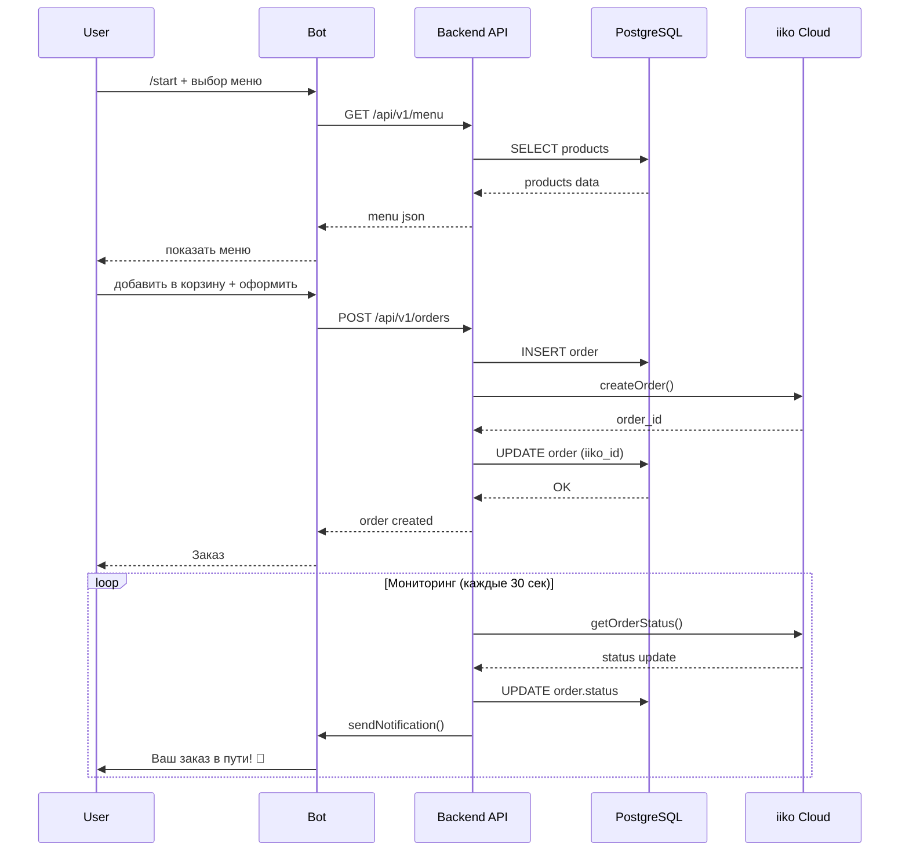
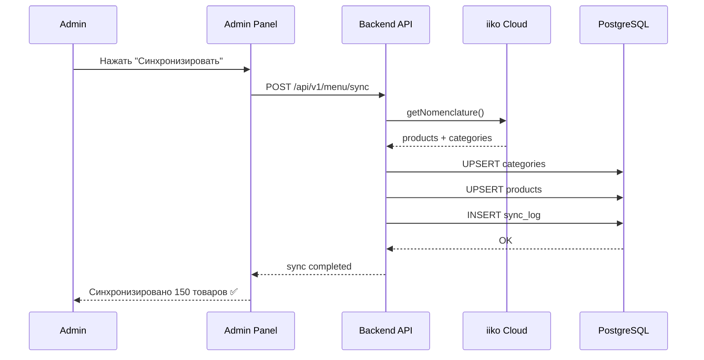
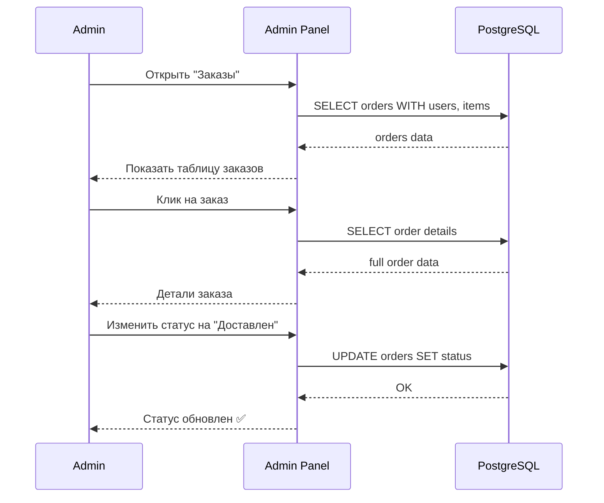

# DovezU - Архитектура системы

> **Подробное описание** архитектуры системы управления доставкой DovezU

## 📋 Содержание

1. [Обзор архитектуры](#обзор-архитектуры)
2. [Компоненты системы](#компоненты-системы)
3. [Взаимодействие компонентов](#взаимодействие-компонентов)
4. [Потоки данных](#потоки-данных)
5. [База данных](#база-данных)
6. [API спецификация](#api-спецификация)
7. [Безопасность](#безопасность)
8. [Масштабирование](#масштабирование)

---

## 🏗️ Обзор архитектуры

DovezU построена по **микросервисной архитектуре** с разделением на три основных компонента:

```
┌─────────────────────────────────────────────────────────────┐
│                        Internet                              │
└────────────────────┬────────────────────┬───────────────────┘
                     │                    │
                     ▼                    ▼
        ┌────────────────────┐   ┌──────────────────┐
        │   Web Browsers     │   │  Telegram Bot    │
        │   (Admins)         │   │   (Customers)    │
        └──────────┬─────────┘   └────────┬─────────┘
                   │                      │
                   ▼                      │
           ┌───────────────┐             │
           │     Nginx     │◄────────────┘
           │  (Proxy/SSL)  │
           └───────┬───────┘
                   │
       ┌───────────┴────────────┐
       │                        │
       ▼                        ▼
┌─────────────┐         ┌─────────────┐
│   Admin     │◄───────►│   Backend   │
│   Panel     │         │     API     │
│  (Laravel)  │         │  (FastAPI)  │
└──────┬──────┘         └──────┬──────┘
       │                       │
       │        ┌──────────────┴────────┐
       │        │                       │
       ▼        ▼                       ▼
┌──────────────────┐            ┌─────────────┐
│   PostgreSQL     │            │    Redis    │
│   (Database)     │            │   (Cache)   │
└──────────────────┘            └─────────────┘
       ▲
       │
       │         ┌────────────────────┐
       └─────────│   iiko Cloud API   │
                 │   (External POS)   │
                 └────────────────────┘
```

### Архитектурные принципы

1. **Separation of Concerns** - Четкое разделение ответственности между компонентами
2. **API-First** - Все взаимодействие через REST API
3. **Stateless** - Сервисы не хранят состояние между запросами
4. **Event-Driven** - Асинхронная обработка заказов и уведомлений
5. **Security by Design** - Безопасность встроена на всех уровнях

---

## 🧩 Компоненты системы

### 1. Admin Panel (Laravel + Filament)

**Назначение**: Административная панель для управления системой

**Технологии**:
- Laravel 12.x (PHP 8.2+)
- Filament 3.2+ (Admin UI)
- Livewire (Reactive Components)
- Tailwind CSS

**Основные функции**:
- 👥 Управление пользователями и ролями
- 🍕 Управление меню и категориями
- 📦 Обработка и мониторинг заказов
- 🎯 Управление программой лояльности
- 📊 Статистика и аналитика
- ⚙️ Настройки системы и интеграций
- 🔄 Синхронизация с iiko Cloud

**Структура**:
```
admin/
├── app/
│   ├── Filament/
│   │   ├── Resources/      # CRUD интерфейсы
│   │   ├── Widgets/        # Дашборд виджеты
│   │   └── Pages/          # Кастомные страницы
│   ├── Models/             # Eloquent модели
│   ├── Http/Controllers/   # HTTP контроллеры
│   └── Services/           # Бизнес-логика
├── database/
│   ├── migrations/         # Схема БД
│   └── seeders/           # Начальные данные
└── resources/
    ├── views/             # Blade шаблоны
    └── js/                # JavaScript
```

**Порты**:
- Development: 8001
- Production: через Nginx (80/443)

---

### 2. Backend API (FastAPI)

**Назначение**: RESTful API для мобильных приложений и интеграций

**Технологии**:
- FastAPI 0.109+ (Python 3.11+)
- SQLAlchemy 2.0+ (ORM)
- Pydantic (Validation)
- asyncpg (Async PostgreSQL)
- httpx (HTTP Client)

**Основные функции**:
- 🍔 API для получения меню
- 🛒 API для создания и управления заказами
- 💳 API программы лояльности
- 🔄 Интеграция с iiko Cloud
- 📈 Мониторинг заказов в реальном времени
- 📬 Уведомления через Telegram

**Структура**:
```
backend/
├── app/
│   ├── api/
│   │   └── endpoints/      # API routes
│   │       ├── menu.py     # Меню endpoints
│   │       ├── orders.py   # Заказы endpoints
│   │       └── loyalty.py  # Лояльность endpoints
│   ├── core/
│   │   ├── config.py       # Конфигурация
│   │   └── database.py     # Подключение к БД
│   ├── models/             # SQLAlchemy модели
│   └── services/
│       ├── iiko_cloud.py   # iiko интеграция
│       ├── menu_service.py # Логика меню
│       ├── order_service.py # Логика заказов
│       └── order_monitor.py # Мониторинг
└── main.py                 # Точка входа
```

**Порты**:
- Development: 8000
- Production: через Nginx (80/443)

**Ключевые особенности**:
- Автоматическая API документация (Swagger/ReDoc)
- Async/await для всех операций БД
- Валидация через Pydantic models
- Background tasks для мониторинга
- Graceful shutdown

---

### 3. Telegram Bot (aiogram)

**Назначение**: Интерфейс для клиентов через Telegram

**Технологии**:
- aiogram 3.17+ (Bot Framework)
- httpx (Backend API Client)
- Redis (State Storage)

**Основные функции**:
- 🤖 Прием заказов через чат
- 📋 Просмотр меню
- 📍 Выбор адреса доставки
- 💰 Расчет стоимости
- 🔔 Уведомления о статусе заказа
- 🎁 Управление бонусами лояльности

**Структура**:
```
bot/
├── handlers/
│   ├── start.py      # /start команда
│   ├── menu.py       # Просмотр меню
│   ├── cart.py       # Корзина
│   └── orders.py     # Заказы
├── keyboards/        # Telegram клавиатуры
├── middlewares/      # Middleware
└── main.py          # Точка входа
```

**Workflow заказа**:
1. Пользователь открывает бота → `/start`
2. Выбирает товары из меню → добавляет в корзину
3. Указывает адрес доставки
4. Подтверждает заказ → API создает заказ
5. Получает уведомления об изменении статуса

---

### 4. PostgreSQL Database

**Назначение**: Центральное хранилище данных

**Версия**: PostgreSQL 15+

**Основные таблицы**:

```sql
-- Пользователи и роли
users
roles
role_user

-- Меню и товары
categories
products
product_modifiers
menu_sync_log

-- Заказы
orders
order_items
order_statuses
order_history

-- Программа лояльности
loyalty_cards
loyalty_transactions
loyalty_rules

-- Интеграции
iiko_organizations
iiko_terminals
sync_logs
```

**Индексы**:
- `orders.created_at` - для быстрой выборки последних заказов
- `orders.status` - для фильтрации по статусу
- `products.category_id` - для группировки по категориям
- `loyalty_cards.phone` - для поиска по телефону

**Резервное копирование**:
- Ежедневные автоматические бэкапы
- Point-in-time recovery (PITR)
- Репликация (опционально)

---

### 5. Redis Cache

**Назначение**: Кэширование и очереди

**Использование**:
- 🔄 Кэш результатов API запросов
- 🗂️ Сессии Laravel
- 📬 Очереди задач
- 🤖 Состояние Telegram Bot FSM

**Конфигурация**:
```redis
maxmemory 512mb
maxmemory-policy allkeys-lru
save 900 1
save 300 10
save 60 10000
```

---

### 6. Nginx (Reverse Proxy)

**Назначение**: Веб-сервер и обратный прокси

**Функции**:
- 🌐 Обслуживание статических файлов
- 🔐 SSL терминация
- ⚖️ Load balancing (при масштабировании)
- 🛡️ Rate limiting
- 📦 Gzip compression
- 🔒 Security headers

**Конфигурация**:
```nginx
server {
    listen 80;
    listen 443 ssl http2;
    server_name your-domain.com;

    # Admin Panel
    location /admin {
        proxy_pass http://localhost:8001;
    }

    # Backend API
    location /api {
        proxy_pass http://localhost:8000;
    }

    # Static files
    location /static {
        alias /opt/foodtech/admin/public;
    }
}
```

---

## 🔄 Взаимодействие компонентов

### Сценарий 1: Создание заказа через Telegram Bot



### Сценарий 2: Синхронизация меню из iiko



### Сценарий 3: Просмотр заказов в админке



---

## 📊 Потоки данных

### Жизненный цикл заказа

```
[Создание]        [Подтверждение]   [Приготовление]   [Доставка]      [Завершение]
    ↓                   ↓                  ↓               ↓               ↓
  new         →      confirmed    →     cooking    →   on_way    →    delivered
                                                                         cancelled
```

**Статусы заказа**:
1. `new` - Создан, ожидает подтверждения
2. `confirmed` - Подтвержден, передан в iiko
3. `cooking` - Готовится
4. `on_way` - В пути к клиенту
5. `delivered` - Доставлен
6. `cancelled` - Отменен

**Триггеры**:
- При переходе в `confirmed` → отправка в iiko
- При переходе в `on_way` → уведомление клиенту
- При переходе в `delivered` → начисление бонусов

### Синхронизация данных

```
iiko Cloud (Source of Truth)
        ↓
   [Sync Service]
        ↓
    PostgreSQL
        ↓
    ┌───┴────┐
    ↓        ↓
Admin Panel  Backend API
    ↓           ↓
  Admins    Telegram Bot
```

**Частота синхронизации**:
- Меню: По требованию + раз в 6 часов
- Заказы: Каждые 30 секунд (мониторинг)
- Статусы: Real-time через webhooks (опционально)

---

## 🗄️ База данных

### ER Диаграмма (основные таблицы)

```
┌──────────────┐       ┌──────────────┐       ┌──────────────┐
│    users     │       │   orders     │       │  categories  │
├──────────────┤       ├──────────────┤       ├──────────────┤
│ id PK        │───┐   │ id PK        │   ┌───│ id PK        │
│ name         │   │   │ user_id FK   │───┘   │ name         │
│ email        │   │   │ status       │       │ iiko_id      │
│ phone        │   │   │ total        │       │ image        │
│ password     │   │   │ address      │       └──────────────┘
└──────────────┘   │   │ iiko_id      │              │
                   │   │ created_at   │              │
┌──────────────┐   │   └──────────────┘              │
│ loyalty_cards│   │           │                     │
├──────────────┤   │           │                     │
│ id PK        │   │   ┌───────┴──────────┐          │
│ user_id FK   │───┘   │                  │          │
│ points       │       ↓                  ↓          │
│ phone        │  ┌─────────────┐  ┌─────────────┐  │
│ created_at   │  │ order_items │  │ order_history│ │
└──────────────┘  ├─────────────┤  ├─────────────┤  │
                  │ id PK       │  │ id PK       │  │
                  │ order_id FK │  │ order_id FK │  │
                  │ product_id FK│ │ status      │  │
                  │ quantity    │  │ created_at  │  │
                  │ price       │  └─────────────┘  │
                  └─────────────┘                   │
                         │                          │
                         └──────────────────────────┘
                                    ↓
                            ┌──────────────┐
                            │   products   │
                            ├──────────────┤
                            │ id PK        │
                            │ category_id FK│
                            │ name         │
                            │ price        │
                            │ iiko_id      │
                            │ image        │
                            │ available    │
                            └──────────────┘
```

### Индексная стратегия

```sql
-- Частые запросы
CREATE INDEX idx_orders_status ON orders(status);
CREATE INDEX idx_orders_created_at ON orders(created_at DESC);
CREATE INDEX idx_orders_user_id ON orders(user_id);

-- Поиск
CREATE INDEX idx_products_name ON products USING gin(to_tsvector('russian', name));
CREATE INDEX idx_loyalty_cards_phone ON loyalty_cards(phone);

-- Внешние ключи (автоматически)
CREATE INDEX idx_order_items_order_id ON order_items(order_id);
CREATE INDEX idx_order_items_product_id ON order_items(product_id);
```

---

## 🔌 API спецификация

### Backend API Endpoints

#### Меню
```
GET    /api/v1/menu              # Получить меню
GET    /api/v1/menu/{id}         # Получить товар
POST   /api/v1/menu/sync         # Синхронизировать с iiko
GET    /api/v1/categories        # Получить категории
```

#### Заказы
```
GET    /api/v1/orders            # Список заказов
POST   /api/v1/orders            # Создать заказ
GET    /api/v1/orders/{id}       # Получить заказ
PUT    /api/v1/orders/{id}       # Обновить заказ
DELETE /api/v1/orders/{id}       # Отменить заказ
GET    /api/v1/orders/{id}/status # Статус заказа
```

#### Лояльность
```
GET    /api/v1/loyalty/{phone}   # Получить карту
POST   /api/v1/loyalty           # Создать карту
POST   /api/v1/loyalty/earn      # Начислить баллы
POST   /api/v1/loyalty/spend     # Списать баллы
GET    /api/v1/loyalty/{phone}/history # История операций
```

### Примеры запросов

#### Создание заказа
```bash
curl -X POST http://localhost:8000/api/v1/orders \
  -H "Content-Type: application/json" \
  -d '{
    "user_id": 1,
    "items": [
      {"product_id": 10, "quantity": 2},
      {"product_id": 15, "quantity": 1}
    ],
    "address": "ул. Ленина, 1",
    "phone": "+79001234567",
    "comment": "Домофон не работает"
  }'
```

#### Получение меню
```bash
curl http://localhost:8000/api/v1/menu?category=pizza
```

---

## 🔐 Безопасность

### Аутентификация и авторизация

**Admin Panel**:
- Laravel Sanctum/Session-based auth
- Role-based access control (RBAC)
- Роли: admin, manager, operator

**Backend API**:
- Token-based authentication
- API keys для интеграций
- Rate limiting: 100 req/min per IP

**Telegram Bot**:
- Аутентификация через Telegram User ID
- Верификация phone number
- Anti-spam механизмы

### Защита данных

1. **Шифрование**
   - HTTPS для всех соединений
   - Пароли: bcrypt (Laravel), pbkdf2 (Python)
   - Чувствительные данные в БД: encrypted columns

2. **Валидация входных данных**
   - Request validation (Laravel)
   - Pydantic models (FastAPI)
   - SQL injection protection (ORM)
   - XSS protection (escaped output)

3. **Секреты**
   - Хранение в `.env` файлах
   - Не коммитятся в git
   - Доступ только root/www-data

### Security Headers

```nginx
add_header X-Frame-Options "SAMEORIGIN";
add_header X-Content-Type-Options "nosniff";
add_header X-XSS-Protection "1; mode=block";
add_header Referrer-Policy "strict-origin-when-cross-origin";
add_header Content-Security-Policy "default-src 'self'";
```

---

## 📈 Масштабирование

### Горизонтальное масштабирование

```
        ┌──────────────┐
        │ Load Balancer│
        └──────┬───────┘
               │
     ┌─────────┼─────────┐
     │         │         │
     ▼         ▼         ▼
┌────────┐ ┌────────┐ ┌────────┐
│ API #1 │ │ API #2 │ │ API #3 │
└───┬────┘ └───┬────┘ └───┬────┘
    │          │          │
    └──────────┼──────────┘
               ▼
        ┌──────────────┐
        │  PostgreSQL  │
        │  (Master)    │
        └──────┬───────┘
               │
       ┌───────┴───────┐
       ▼               ▼
  ┌─────────┐    ┌─────────┐
  │ Replica │    │ Replica │
  │   #1    │    │   #2    │
  └─────────┘    └─────────┘
```

### Вертикальное масштабирование

**PostgreSQL**:
- Увеличить `shared_buffers` до 25% RAM
- Увеличить `max_connections`
- SSD диски для лучшей производительности

**Redis**:
- Увеличить `maxmemory`
- Включить persistence (AOF)

**PHP-FPM**:
- Увеличить `pm.max_children`
- Настроить `pm.max_requests`

### Кэширование

**Уровни кэша**:
1. **Application Level** - Redis cache
2. **Database Level** - Query results cache
3. **HTTP Level** - Nginx cache
4. **CDN Level** - Static assets

### Мониторинг производительности

**Метрики для отслеживания**:
- Response time (p50, p95, p99)
- Requests per second
- Error rate
- Database query time
- Cache hit ratio
- CPU/Memory usage

**Инструменты**:
- Laravel Telescope (development)
- FastAPI built-in metrics
- Prometheus + Grafana
- ELK Stack для логов

---

## 🚀 Deployment Strategies

### Blue-Green Deployment

```
Production (Green)    Staging (Blue)
       │                    │
       ▼                    ▼
   ┌────────┐          ┌────────┐
   │ v1.0.0 │          │ v1.1.0 │
   └────────┘          └────────┘
       │                    │
       └────────┬───────────┘
                ▼
         Switch traffic
                │
       ┌────────┴────────┐
       ▼                 ▼
   Old version      New version
    (backup)         (active)
```

### Rolling Updates

```bash
# Обновление без downtime
docker compose up -d --no-deps --build admin
docker compose up -d --no-deps --build backend
docker compose up -d --no-deps --build bot
```

---

## 📝 Заключение

Архитектура DovezU спроектирована с учетом:
- ✅ Масштабируемости
- ✅ Безопасности
- ✅ Производительности
- ✅ Поддерживаемости
- ✅ Расширяемости

Для более детальной информации см.:
- [README.md](README.md) - Основная документация
- [SETUP_GUIDE.md](SETUP_GUIDE.md) - Установка и настройка
- [AI_INSTRUCTIONS.md](AI_INSTRUCTIONS.md) - Инструкции для AI

---

*Последнее обновление: 2026-02-19*
*Версия: 1.0*
